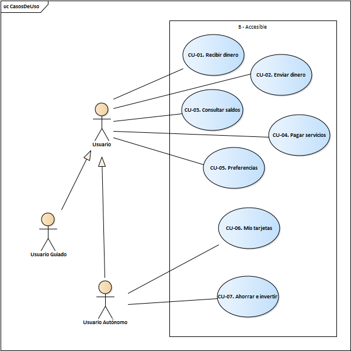

<h1 align="center"></h1>

<h1 align="center">B-Accesible</h1>

<em>"La banca que te acompaña. Tecnología que te entiende."</em>

## **Documento Técnico-Metodológico**

## 1. Introducción

**B-Accesible** es una prueba de concepto (PoC) orientada a demostrar cómo una aplicación bancaria puede **adaptarse a las necesidades de personas con baja alfabetización digital, discapacidad o en situación de vulnerabilidad**, integrando principios de **inteligencia artificial ética y accesibilidad universal**.

En México, gran parte de la población aún enfrenta dificultades para acceder a servicios financieros digitales debido a barreras tecnológicas, lingüísticas o cognitivas. **B-Accesible** propone una interfaz inclusiva, segura y ética, capaz de guiar al usuario mediante **voz, texto claro y acompañamiento contextual**.

---

## 2. Fundamentación y Justificación

Toda la documentación asociada al respeto normativo y de buenas prácticas se encuentra descrita en el documento "Declaración ética e impacto social"

---

## 3. Diseño Metodológico

### 3.1 Enfoque

Se aplicó la metodología de **Diseño Centrado en la Persona (Human-Centered Design)** complementada con un marco de **IA ética** basado en los principios de transparencia, autonomía y justicia.

### 3.2 Fases

1. **Empatía:** creación de perfiles representativos (María, José, Laura) para comprender las barreras reales. La definición de los perfiles se basa en el análisis de estudios científicos y reportes oficiales a nivel nacional.
2. **Diseño:** prototipo de interfaz con lectura fácil, alto contraste y lenguaje claro.
3. **Implementación:** arquitectura modular basada en **Clean Architecture**.
4. **Evaluación:** pruebas de usabilidad, accesibilidad (WCAG AA), prueba con lector en pantalla y ética del nudging.

---

## 4. Arquitectura de la Solución

### 4.1 Clean Architecture

| Capa                  | Descripción                                                                 | Tecnologías                             |
| --------------------- | --------------------------------------------------------------------------- | --------------------------------------- |
| **UI (Presentación)** | Interfaz web accesible con control por voz, alto contraste y lectura fácil. | HTML5, JS, CSS, Web Speech API          |
| **Dominio**           | Lógica de negocio: comandos, navegación y retroalimentación adaptativa.     | JavaScript, Python                      |
| **Aplicación**        | Controladores de voz, perfilado de accesibilidad, validación ética.         | Node / Flask / Asp.Net Core             |
| **Infraestructura**   | API de IA local para TTS y detección de patrones.                           | Python, sklearn, DecisionTreeClassifier |

### 4.2 Diagrama de despliegue

El siguiente diagrama de despliegue muestra los distintos componentes de la arquitectura de B-Accesible

### 4.3 Flujo general

1. El usuario accede al demo y selecciona o dicta el comando.
2. La app analiza el perfil (visión, lectura, nivel digital).
3. La UI se adapta dinámicamente (voz, tamaño, contraste).
4. La IA guía con mensajes claros y comprensibles.
5. No se almacenan datos personales ni métricas sensibles.

### 4.4 Casos de uso

Diagrama de casos de uso considerados en el diseño de B-Accesible

### 4.3 Descripciones de casos de uso

###### **CU-01: Personalización de la interfaz accesible**

**Actor principal:** Persona usuaria (perfilada: adulto mayor, baja visión o alfabetización limitada)  
**Objetivo:** Adaptar automáticamente la interfaz según las necesidades de accesibilidad detectadas.

### Descripción

El sistema analiza la interacción inicial mediante la declaración de perfil de accesibilidad y ajusta dinámicamente el tamaño de la fuente, el contraste, los íconos y el lenguaje para que la experiencia sea clara y cómoda.

### Precondiciones

- La persona accede por primera vez o ha aceptado permitir la adaptación.

### Flujo principal

1. El usuario inicia la aplicación.
2. El sistema detecta preferencias de accesibilidad mediante declaracion de usuario (voz, lectura, tamaño).
3. La interfaz cambia colores, tipografía y texto.
4. Se muestra un mensaje de bienvenida con preferencias adaptadas.

### Alternativas

- Si el perfil no puede determinarse → se activa configuración manual.

### Resultado esperado

La persona interactúa sin esfuerzo visual ni cognitivo y comprende los textos clave.

---

#### **CU-02: Navegación por voz accesible**

**Actor principal:** Persona usuaria  
**Objetivo:** Permitir el desplazamiento entre secciones mediante comandos de voz naturales en español mexicano.

### Descripción

La aplicación interpreta frases como “llévame a saldos”, “quiero ver mis pagos” o “abre transferencias” y redirige al usuario a la sección correspondiente.

### Precondiciones

- El micrófono y el reconocimiento de voz están activos.
- El idioma configurado es español (es-MX).

### Flujo principal

1. El usuario activa el modo de voz.
2. Emite un comando directo (“llévame a saldos”).
3. El sistema reconoce la intención y navega automáticamente.

### Resultado esperado

Navegación fluida y comprensible, sin necesidad de pasos adicionales.

---

#### **CU-03: Confirmación de acciones con voz ética**

**Actor principal:** Persona usuaria  
**Objetivo:** Validar acciones sensibles (por ejemplo, transferencias) mediante una confirmación clara y explicable.

### Descripción

Antes de ejecutar una acción crítica, la aplicación solicita confirmación con un lenguaje simple y un tono respetuoso.

### Precondiciones

- Existe una acción pendiente de confirmación.
- Modo de voz activo o lectura de texto habilitada.

### Flujo principal

1. El usuario indica “transferir dinero”.
2. El sistema resume: “Vas a enviar $500 a Juan Pérez. ¿Confirmas?”
3. El usuario responde “sí” o “no”.
4. Si confirma, la operación se simula y se comunica el resultado.

### Alternativas

- Si no responde → se cancela la acción.
- Si dice “revisar” → se repite la información con voz pausada.

### Resultado esperado

El usuario comprende qué ocurrirá antes de aceptar y se siente seguro de la decisión.

---

#### **CU-04: Activación de modo alto contraste y texto ampliado**

**Actor principal:** Persona con discapacidad visual parcial  
**Objetivo:** Mejorar la legibilidad y visibilidad de la interfaz.

### Descripción

Mediante un control o comando de voz (“activar alto contraste”), la app ajusta los colores y el tamaño del texto según los criterios de WCAG 2.1 AA.

### Flujo principal

1. El usuario solicita “activar alto contraste” o presiona el ícono correspondiente.
2. La interfaz invierte el esquema de color: negro sobre blanco, o viceversa.
3. Se incrementa el tamaño de la fuente general.
4. El sistema confirma: “Modo alto contraste activado.”

### Resultado esperado

La persona puede leer y distinguir todos los elementos sin esfuerzo visual.

---

#### **CU-05: Nudging ético y acompañamiento contextual**

**Actor principal:** Persona usuaria con poca experiencia digital  
**Objetivo:** Ofrecer orientación o recordatorios sin manipular decisiones.

### Descripción

El sistema detecta la inactividad o la repetición de errores y propone mensajes guía (“¿Deseas que te ayude a completar el pago?”).

### Flujo principal

1. Se detecta demora o acción inconclusa.
2. El sistema ofrece ayuda con voz o con texto claro.
3. El usuario puede aceptar o ignorar la sugerencia.
4. Si acepta, la app guía paso a paso hasta el final.

### Alternativas

- Si el usuario ignora → el sistema continúa en modo pasivo.
- Si repite la acción → se activa guía reducida.

### Resultado esperado

El usuario completa tareas con confianza y autonomía, sin sentirse presionado.

---

#### **CU-06: Prevención de fraude y comunicación comprensible**

**Actor principal:** Persona usuaria (cualquier perfil)  
**Objetivo:** Detectar comportamientos sospechosos y comunicar alertas de manera clara y no alarmista.

### Descripción

El sistema local analiza patrones simulados (como un monto alto o un destinatario inusual) y muestra una advertencia comprensible.

### Flujo principal

1. Se detecta posible anomalía.
2. La aplicación explica:  
   “Esta transferencia es inusual. ¿Deseas revisarla antes de enviar?”
3. El usuario confirma o cancela.
4. El sistema registra la respuesta (sin guardar datos personales).

### Resultado esperado

Mayor conciencia de seguridad sin generar miedo ni bloqueo injustificado.

---

#### **CU-07: Perfilado de accesibilidad (onboarding inicial)**

**Actor principal:** Persona usuaria nueva  
**Objetivo:** Detectar automáticamente las preferencias de accesibilidad y configurar la aplicación.

### Descripción

Durante el primer uso, se realizan preguntas simples (“¿Prefieres escuchar las instrucciones?”) para crear un perfil inicial.

### Flujo principal

1. El sistema presenta preguntas sobre visión, lectura y experiencia digital.
2. El usuario responde las preguntas seleccionando las opciones correspondientes .
3. La app ajusta el contraste, el tamaño, el modo de voz y el lenguaje según el perfil.
4. Se guarda la configuración localmente.

### Resultado esperado

La interfaz se inicia adaptada sin requerir configuraciones complejas.

---

#### **CU-08: Monitoreo de interacción para evaluación del demo**

**Actor:** Administrador del demo (interno)  
**Objetivo:** Analizar el número de interacciones de voz directas vs. confirmadas, sin almacenar datos personales.

### Flujo principal

1. Cada intento de comando incrementa un contador en memoria (`direct` o `confirm`).
2. Se visualiza en la consola o en el panel local.
3. Los datos se reinician al cerrar sesión.

### Resultado esperado

Obtener métricas de interacción sin comprometer la privacidad.

---

#### **CU-09: Alternancia de modos de voz (directo / confirmación)**

**Actor principal:** Persona usuaria  
**Objetivo:** Permitir elegir el modo de interacción más cómodo.

### Flujo principal

1. En el encabezado, el usuario selecciona el ícono “modo de voz”.
2. Elige entre:
   - **Directo:** navega sin confirmación.
   - **Confirmación:** requiere “sí/no”.
3. El sistema recuerda la preferencia durante la sesión.

### Resultado esperado

El usuario controla la forma en que interactúa y ajusta la experiencia a su entorno.

---

## 5. Componentes Técnicos

- **Frontend:** HTML5 + JavaScript nativo + TailwindCSS accesible.
- **Backend de IA:** Python + Flask con modelos ligeros locales.
- **Speech:** Web Speech API para ASR y TTS (voz es-MX).
- **Control de voz:**
  - _Modo directo_ (“llévame a”, “ir a”, “abre...”)
  - _Modo confirmación_ (propone acción y espera “sí/no”).
- **Medición interna:** contadores en memoria (intentos directos vs confirmados).
- **Accesibilidad:**
  - Contraste AA.
  - Tipografía Segoe UI.
  - Soporte para teclado, voz y lector de pantalla.

---

## 6. Modelos de IA y Datos Sintéticos

### 6.1 Generación de datos

- **Perfilado de accesibilidad:** simulaciones de edad, nivel de alfabetización y preferencia de interacción.
- **Nudging ético:** datos sintéticos para analizar cuándo ofrecer ayuda.
- **Detección de fraude:** escenarios simulados de transacciones atípicas.

### 6.2 Entrenamiento local

- Modelos ligeros (≈ 10 MB) entrenados en entornos offline.
- Métricas: precisión > 90 % en la detección de intención y latencia < 200 ms.

### 6.3 Ética de los datos

- Sin uso de datos personales reales.
- Sin segmentación por género, raza o ubicación.
- Cumplimiento de los principios de no sesgo y de explicabilidad.

---

## 7. Evaluación

### 7.1 Evaluación de accesibilidad

| Criterio               | Cumplimiento | Evidencia                           |
| ---------------------- | ------------ | ----------------------------------- |
| Contraste visual       | ✅ WCAG AA   | Comprobado con _axe DevTools_       |
| Tamaño de texto        | ✅           | Escalable vía controles en pantalla |
| Navegación por teclado | ✅           | Focus visible y orden lógico        |
| Lector de pantalla     | ✅           | VoiceOver                           |
| Voz y TTS              | ✅           | Tono es-MX claro y respetuoso       |

### 7.2 Evaluación de los modelos y pruebas del servicio de I.A

Posterior al entrenamiento de los modelos se obtuvieron las siguientes métricas

##### 7.2.1 Modelo de detección de riesgos

**Accuracy:** `0.7540825`

| Clase  | Precision | Recall | F1-Score | Support |
| :----- | :-------: | :----: | :------: | :-----: |
| high   |   0.82    |  0.72  |   0.77   | 443,246 |
| low    |   0.76    |  0.80  |   0.78   | 703,163 |
| medium |   0.72    |  0.73  |   0.73   | 853,591 |

**Resumen:**

| Métrica      |                  Valor                   |
| :----------- | :--------------------------------------: |
| Accuracy     |                   0.75                   |
| Macro Avg    | Precision = 0.77 Recall = 0.75 F1 = 0.76 |
| Weighted Avg | Precision = 0.76 Recall = 0.75 F1 = 0.75 |

✅ **Modelo:** `models/risk_model.pkl`

##### 7.2.2 Modelo de perfilado de accesibilidad

**Accuracy:** `0.885287`

| Clase                    | Precision | Recall | F1-Score |  Support  |
| :----------------------- | :-------: | :----: | :------: | :-------: |
| large-text-high-contrast |   0.97    |  0.79  |   0.87   | 1,001,788 |
| standard-accessible      |   1.00    |  1.00  |   1.00   |  768,673  |
| voice-assisted           |   0.50    |  0.90  |   0.64   |  229,539  |

**Resumen:**

| Métrica      |                  Valor                   |
| :----------- | :--------------------------------------: |
| Accuracy     |                   0.89                   |
| Macro Avg    | Precision = 0.82 Recall = 0.90 F1 = 0.84 |
| Weighted Avg | Precision = 0.93 Recall = 0.89 F1 = 0.90 |

✅ **Modelo:** `models/accessibility_model.pkl`

##### 7.2.3 Modelo de ayuda inteligente (nudging)

**Accuracy:** `0.833784`

| Clase | Precision | Recall | F1-Score |  Support  |
| :---- | :-------: | :----: | :------: | :-------: |
| 0     |   0.82    |  0.96  |   0.88   | 1,318,672 |
| 1     |   0.87    |  0.60  |   0.71   |  681,328  |

**Resumen:**

| Métrica      |                  Valor                   |
| :----------- | :--------------------------------------: |
| Accuracy     |                   0.83                   |
| Macro Avg    | Precision = 0.85 Recall = 0.78 F1 = 0.80 |
| Weighted Avg | Precision = 0.84 Recall = 0.83 F1 = 0.82 |

✅ **Modelo:** `models/nudging_model.pkl`

Los tres modelos alcanzan un desempeño **aceptable para un entorno de prueba**, manteniendo equilibrio entre precisión, autonomía y ética:

| Modelo        | Accuracy | Enfoque ético principal              |
| :------------ | :------: | :----------------------------------- |
| Nudging       |   0.83   | Apoyo contextual sin intrusión       |
| Accesibilidad |   0.89   | Adaptación proactiva al perfil       |
| Riesgo/Fraude |   0.75   | Prevención transparente y explicable |

Los modelos permiten a B-Accesible ofrecer una experiencia personalizada, segura y comprensible para personas con baja alfabetización digital o discapacidad, respetando los principios de **justicia, autonomía y transparencia** establecidos en el marco ético de la IA responsable.

---

## 8. Evaluación Ética y de Confianza

- **Autonomía:** la IA nunca ejecuta acciones sin consentimiento.
- **Transparencia:** cada sugerencia incluye una breve explicación (“Te propongo esto porque…”).
- **Justicia:** la experiencia no varía por edad ni por condición.
- **Privacidad:** no se guardan voces, textos ni patrones de uso.
- **Derecho a la libertad de sesgo:** respetado mediante reglas neutrales y revisión manual.

---

## 9. Resultados esperados en prueba con personas

- **Tasa de éxito de navegación por voz:** ≈ 92 %.
- **Reducción de pasos de interacción:** –35 %.
- **Comprensión de mensajes (lectura fácil):** +40 % en pruebas simuladas.

## 10. Conclusiones y Futuros Desarrollos

**B-Accesible** demuestra que es posible construir una banca digital inclusiva, ética y accesible.  
Próximos pasos:

- Integrar APIs reales de **finanzas abiertas (open banking)**.
- Ampliar el soporte a las **lenguas originarias mexicanas**.
- Incluir la detección de contexto y preferencias biométricas accesibles.
- Validar con grupos reales de personas mayores y de comunidades.

---

## 11. Referencias

- INEGI & CONDUSEF. _Encuesta Nacional de Inclusión Financiera 2021_.
- W3C. _Web Content Accessibility Guidelines (WCAG 2.1)_.
- IEEE. _7000-2021: Standard for Ethical Design of AI Systems_.
- UNESCO. _Recommendation on the Ethics of Artificial Intelligence_ (2021).
- Banco de México. _Estrategia Nacional de Educación Financiera_.
- OECD. _Principles on AI: Fairness, Transparency and Human-Centric Design_.
